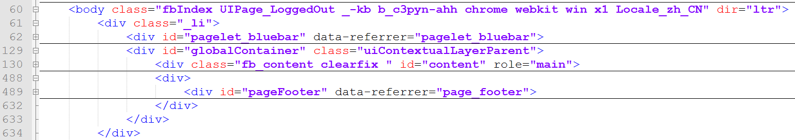
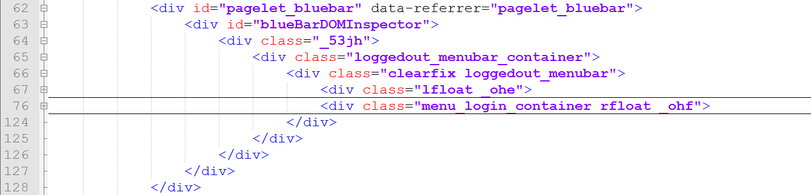
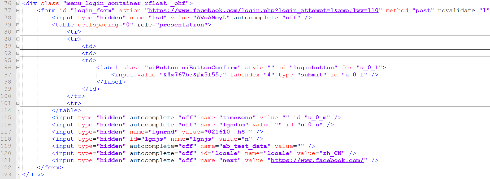
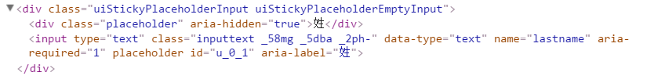
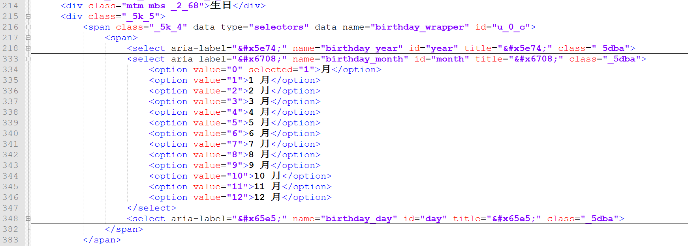
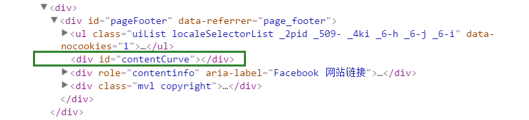

#找茬
原页面：[Facebook首页](https://www.facebook.com/)
##第一点
head里面有N个外链脚本和页内脚本，但是有些`<script>`没有加`async`属性，不知道会不会影响页面的加载

##第二点
原页面内容部分整体结构如下：

* `body`里面的内容不应该全部用`<div>`布局
* `id="pagelet_bluebar"`部分应该用`<header>`标签
* `id="pageFooter"`部分应该用`<footer>`标签，并与`<header>`在同一层

##第三点
`header`部分结构如下：

* 外面嵌套了四层`<div>`是不是太多了，感觉整个页面都有这个问题，太多`<div>`嵌套

##第四点
`header`部分右边的登录表单结构如下：

* 一般`<table>`用于数据的呈现，这里用于表单的布局不太合适，最好用`div+css`布局
* 登录按钮这里用的是`type="submit"`的`<input>`,最好使用`<button>`

##第五点
下面是注册表单的一部分：

* 这里用的`<div>`标签来实现输入提示，直接可以用`<input>`的`placeholder`属性就可以了
* 布局采用`<p>`会比`<div>`更好

##第六点
下面是注册表单里的生日填写部分：

* 这里的年、月、日用到的是三组`<select>`下拉框，完全可以用一个`type="date"`的`<input>`代替

##第七点
`footer`部分结构如下：

* `id="contentCurve"`部分是一条水平分割线，用`<hr/>`就可以了

##第八点
下面这段代码是写在`body`最底下的
```
<iframe height="1" width="1" src="https://staticxx.facebook.com/common/referer_frame.php" style="position: absolute; top: -10px;">
	<!DOCTYPE html>
	<html>
		<head>
			<script>document.domain = 'facebook.com';</script>
		</head>
		<body style="margin: 0px;"></body>
	</html>
</iframe>
```
不明白为什么要把`<script>document.domain = 'facebook.com';</script>`写在`<iframe>`里，不是直接写在`<body>`里吗？
